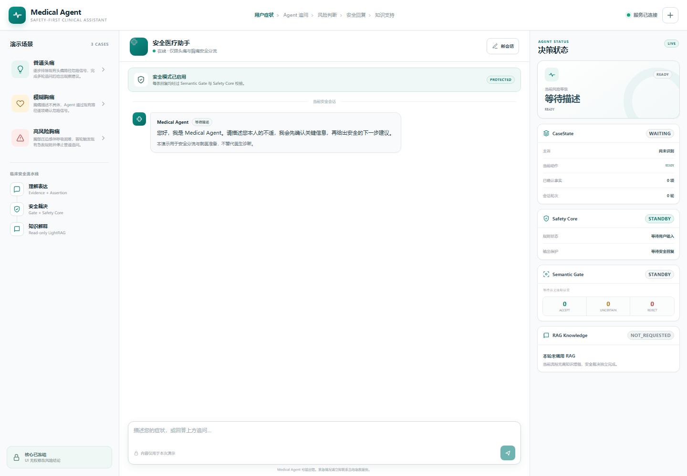

# React Web Demo — 比赛展示界面

## 1. 前端架构

React Web Demo 是一个位于 web/ 的独立 Vite 应用，只依赖 Phase 4 公开 HTTP API。

~~~text
React Stateful Agent UI（5173）
  → Demo API Client（/api）
     → Vite 开发代理
        → Phase 4 Demo API（8003）
           → 既有 Node.js Agent Core
              → Phase 5 Session / Fact Memory / Question Planner
              → 可选 Python LightRAG Service
~~~

- web/src/App.jsx：三栏比赛界面、Session History、会话恢复、Memory Inspector、Agent Trace、固定案例回放和只读 Agent 状态编排；
- web/src/api/demo-api.js：Phase 4 API 的唯一前端访问边界；
- web/src/styles.css：医疗风格、桌面与移动端响应式布局；
- web/src/*.test.*：API 路由、固定案例、多轮 session 复用和异常降级测试。

前端不导入 Node.js Core，不直接读写 CaseState，也不生成或修改风险结论。

Phase 5 的展示语义参考了 LangGraph 的 thread/checkpoint 思路：把同一会话视为连续状态容器，把每轮 CaseState 视为可恢复检查点；项目没有引入 LangGraph，持久化与规划仍由现有 Node.js Memory Layer 实现。

## 2. API 连接与运行

开发环境默认把浏览器的 /api 请求代理至 http://127.0.0.1:8003，因此不需要修改现有 Demo API 或增加 CORS。可通过 web/.env 覆盖：

~~~dotenv
VITE_DEMO_API_BASE_URL=/api
VITE_DEMO_API_TARGET=http://127.0.0.1:8003
~~~

依次启动已有服务：

~~~powershell
npm run start:python-ai
npm run start:python-knowledge
npm run start:demo
npm run start:web
~~~

打开 http://127.0.0.1:5173。如果只演示高风险胸痛的确定性安全升级，可以在 Python 服务不可用时运行；完整头痛、模糊胸痛和 RAG 来源展示需要既有 Python 服务正常运行。

## 3. 页面与演示案例

页面采用现代 Stateful Agent 风格三栏布局：

1. 左栏 Session History：展示按主诉生成的通用会话名称、更新时间、风险等级、轮次和恢复按钮；浏览器只保存会话摘要，真实消息与 CaseState 仍以后端检查点为准；
2. 左栏 Demo Cases：普通头痛、模糊胸痛、高风险胸痛三个一键案例；
3. 中栏 Agent Chat：多轮对话、紧急安全 Banner、结构化回复，以及 `用户输入 → Fact Extraction → Question Planner → Safety Core → RAG → Response` 实时轨迹；
4. 中栏 Question Planner Card：标明当前缺失字段、为什么需要询问，以及 P0/P1/P2 优先级；
5. 右栏 Memory Inspector：展示当前 Session 的持久化状态、快照数量、已确认事实、已回答字段、待确认字段和 CaseState 变化记录；
6. 右栏 Safety Status：继续展示风险等级、Safety Core、Semantic Gate、RAG 状态及来源，不让记忆层或 UI 覆盖安全裁决。

截图文件仍展示基础三栏版本；当前 Phase 5 页面在此基础上增加了左侧历史会话、中央 Agent Trace 与右侧 Memory Inspector。运行任一案例或发送消息后，评委可同时看到事实被写入检查点、Question Planner 选择下一项缺口、Safety Core 完成裁决以及 RAG 是否被调用。

### 会话恢复演示

1. 输入一条症状并完成至少一轮追问；
2. 点击“新会话”，左侧仍保留上一会话的脱敏摘要；
3. 点击该会话的“恢复”；
4. UI 通过既有 `POST /v1/demo/sessions/{sessionId}/resume` 和 `GET /v1/demo/sessions/{sessionId}/history` 恢复历史消息、CaseState 与待回答问题；
5. 继续回答后，系统复用同一 `sessionId`，避免重复询问已经确认的字段。

## 4. 安全边界

- Safety Core、CaseState、Semantic Gate、Multi-turn Loop、Response Layer 和 LightRAG 服务均未修改；
- 前端只渲染服务端返回的结构化安全回复；
- CaseState 面板只通过既有 GET session API 读取，不向后端写入或伪造状态；
- Session History 的 localStorage 条目只含 sessionId、显示名、时间、风险等级和轮次，不保存原始医疗对话；
- 会话恢复必须由服务端检查点校验；前端摘要不能作为医疗事实或风险依据；
- RAG 状态与来源单独展示，不参与或覆盖 riskLevel；
- API 或 RAG 异常时显示明确降级状态，不编造医学内容；
- 页面持续提示本系统不构成医疗诊断或治疗建议。

## 5. 验证

~~~powershell
npm run test:all
npm run test:coverage
~~~

最终验证结果：

- Node.js：296/296；
- Python：19/19；
- React/Vitest：8/8；
- Phase 1 Safety Invariants：10/10；
- Vite 生产构建：通过；
- Node.js 覆盖率：行 93.57%、分支 82.48%、函数 93.60%。
